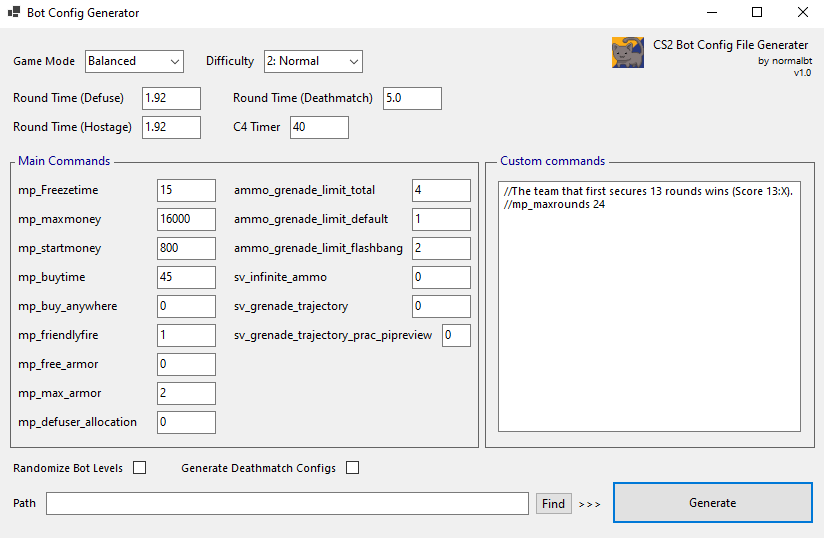

# BotConsoleManager

A practical utility for setting up and managing custom CS2 practice sessions.
It allows users to easily generate, build, and export complex console commands and bot configurations (.cfg files) specifically for private matches and training maps.

The application generates the following config files:
Standard Bot Matches (Casual/Competitive)

• 6.cfg
• 10.cfg
• 12.cfg
• 16.cfg
• 20.cfg

Team Deathmatch (TDM) Bot Matches (If Checked)
These files are generated only if the 'Generate Deathmatch Configs' option is checked.

• 6dm.cfg
• 10dm.cfg
• 12dm.cfg
• 16dm.cfg
• 20dm.cfg

*Note on Windows SmartScreen Warning

Since this application is distributed without a paid Code Signing Certificate, Windows Defender SmartScreen may display a warning about an "unrecognized app" or "untrusted publisher."
This is normal and does NOT indicate a virus or malicious file.

To run the app, please click 'More Info' (or 'Additional Information') and then click the 'Run Anyway' button.

Environment: Tested on Windows 10.
